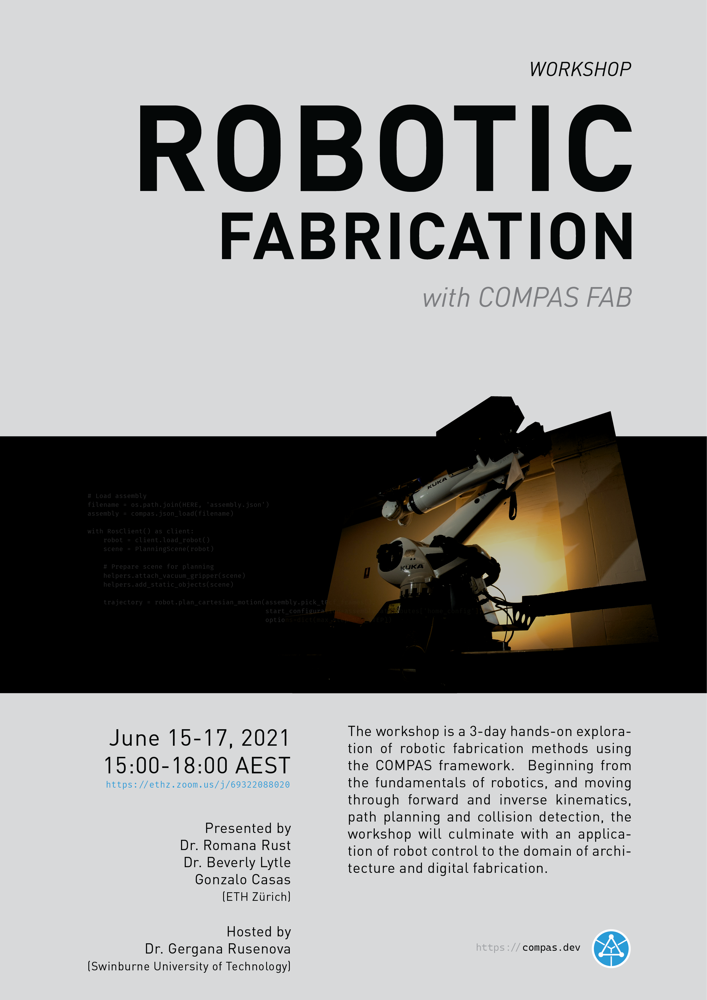

# Workshop Swinburne University of Technology 15., 16., and 17.06.2021

> **Robotic Fabrication with COMPAS FAB**

## Overview

* Intro
* Kinematics
* Path planning
* Scene and end effectors
* Pick and Place
* Assemblies
* Robot control

## Examples

## Requirements

* Minimum OS: Windows 10 Pro or Mac OS Sierra 10.12
* [Anaconda 3](https://www.anaconda.com/distribution/)
* [Docker Desktop](https://www.docker.com/products/docker-desktop) Docker Toolbox would also work but it's a bit more annoying. After installation on Windows, it is required to enable "Virtualization" on the BIOS of the computer.
* [Rhino 6/7 & Grasshopper](https://www.rhino3d.com/download)
* [Visual Studio Code](https://code.visualstudio.com/): Any python editor works, but we recommend VS Code + extensions [as mentioned in our docs](https://gramaziokohler.github.io/compas_fab/latest/getting_started.html#working-in-visual-studio-code-1)

## Installation

We use `conda` to make sure we have clean, isolated environment for dependencies.

First time using `conda`? Make sure you run this at least once:

    (base) conda config --add channels conda-forge

Clone this repository and create a new conda environment:

    (base) cd path/to/workshop_swinburne_2021
    (base) conda env create -f environment.yml
    (base) conda activate swinburne

Alternatively, create environment manually

The conda environment can also be manually created:

    (base) conda create -n swinburne python=3.8 compas_fab>=0.18.3 --yes
    (base) conda activate swinburne

**Mac**

Also install `python.app` after activating the environment:

    (swinburne) conda install python.app

### Verify installation

    (swinburne) python -m compas

    Yay! COMPAS is installed correctly!

    COMPAS: 1.6.3
    Python: 3.8.8 | packaged by conda-forge | (default, Feb 20 2021, 15:50:08) [MSC v.1916 64 bit (AMD64)]
    Extensions: ['compas-cgal', 'compas-fab', 'compas-slicer']

### Install on Rhino

    (swinburne) python -m compas_rhino.install
    (swinburne) python -m compas_rhino.install -v 7.0

### Update installation

To update your environment:

    (swinburne) conda env update -f environment.yml
